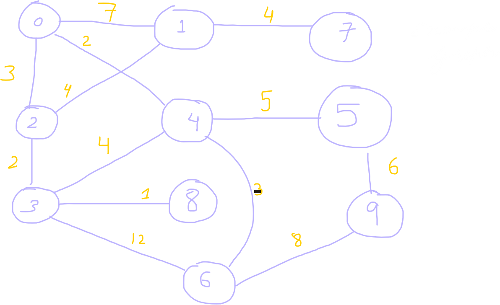

<small> Sourced from: [geeks4geeks](https://www.geeksforgeeks.org/graph-data-structure-and-algorithms/)</small>
 
# GRAPHS 

G(E, V) where E is set of edges connecting 
the set of vertices V


Below few headings will cover some basic topics about graphs that I have learnt. They are sort of like notes. Most of them are copied from geeks4geeks. I will also add any future notes I have here. There might be a few header classes defined for different kinds of graphs or maybe more functioanlities will be added in this folder and split into other files.


## Graph Example

[graph.h](./graph.h) has all the functionalities of an `undirected graph` as of now. Slowly the whole graph folder will be expanded. Checkout [main.cpp](./main.cpp) driver file to test an example undirected graph. Below is the illustration of our example graph used:-



```cpp
//// previous definitions in main ////
graph::uGraph g(10);
// code for graph g to be initialised. Above image as reference 
int start = 0;
int goal = 9;
std::cout<<"UCS traversal from node "<< node_index <<" to "<<goal<<".\n";
g.ucs(start, goal);
std::cout<<"\n";

start = 0;
goal = 4;
std::cout<<"UCS traversal from node "<< node_index <<" to "<<goal<<".\n";
g.ucs(start, goal);
std::cout<<"\n";
////// rest of code in main /////
```

This will give output:- &nbsp;
>   UCS Traversal from node 0 to 9.
>   0 4 2 6 
>   Found goal 9 at cost 13
>   
>   UCS Traversal from node 0 to 4.
>   0
>   Found goal 4 at cost 2


## TYPES

1.  A **Null Graph** has no edges.

2.  A **Trivial Graph** has only a single vertex. Smallest possible graph

3.  A graph in which edges do not have any direction is called Undirected Graph.

4.  **Directed graph** has edges with direction. 
    Illustration1-
    

5.  **Connected Graph** is one in which from one node we can
    visit any other node in the graph

6. **Disconnected graph**: You guessed it! Atleast one node has to
    be not reachable from a node

    Illustration2:-
    

7.  **Regular Graph** is one in which degree of every vertex is equal
    to the other vertices of graph

8.  **Complete Graph**: from each node there is an edge to each other node    
    Illustration3:-
    

9.  **Cycle Graph**: graph is a cycle in itself. Degree of each vertex is 2.
10. **Cyclice Graph**: A graph containing atleast one cycle

    Illustration4:-
    

11. **Directed Acyclic Graph**: A directed graph that does not co-
    ntain any cycle

12. **Bipartite Graph**: A graph in which vertices can be divided into
    two sets st. in each set vertices do not contain any edge
    between them.

13. **Weighted Graph**:
    A graph in which edges are already specified with suit-
    able weight is known as weighted graph.

    weighted graphs further classified based on edge direction
    existence vis a vis Undirected and directed WGs.


## TREES vs GRAPHS

> All trees are graphs.
> Not all graphs are trees.


[Linked List](../linked%20lists/), [Trees](../trees/) and [Heaps](../heap/) are special cases of graphs.


**Illustration:-**


## Representation of Graphs
There are two ways to store a graph:-

1. Adjacency Matrix
2. Adjacency List

### ADJACENCY MATRIX
- 2D Matrix
- rows and columns are vertices
- each value represents the weight of the edge between the vertices

**Illustration:-**


### ADJACENCY LIST 
- represented as a collection of `linked lists`.
- array of pointer which points to the edges connected to that vertex (better understood through illustration below)

**Illustration:-**


### Adjacency Matrix vs Adjacency List

It is good to not have sparse matrix. If there are lot
of edges then adjacency matrix is a good use

Action        | Adj Matrix   | Adj List 
--------------|--------------|---------
Add Edge      |  O(1)        | O(1)
Removing Edge |  O(1)        | O(N)
Initialize    |  O(N*N)      | O(N)


## Basic Operations on Graphs

- Insertion of Nodes/Edges
- Deletion of Nodes/Edges
- Searching on Graphs
- Traversal of Graphs

## Usage of Graphs

- Maps can be respresented using graphs. Use search algo on
them to find shortest route, etc.
- When various tasks depend on each other. This scenario can be represented using a directed acyclic graph. Topological sort helps find order in which tasks can be done.
- State Transition Diagram


